# DATABASE ARCHITECTURE & RELATIONAL DESIGN SPECIFICATION
**Project:** Onnesha Hospital Management System (OHMS)  
**Database Platform:** Supabase PostgreSQL 15+  
**Architecture Type:** Multi-Tenant SaaS (Row Level Security Driven)  
**Date:** September 13, 2026  

---

## 1. Architectural Principles & Isolation Model
1. **Multi-Tenancy via PostgreSQL Row Level Security (RLS):**
   - Single shared PostgreSQL database for horizontal scaling and operational efficiency.
   - Every tenant-scoped entity carries `organization_id UUID NOT NULL REFERENCES organizations(id)`.
   - The session context `app.current_organization_id` filters all reads, writes, updates, and deletes at the storage engine level.
2. **Double-Entry FIFO Stock Ledger:**
   - Medicine inventory is modeled as an immutable ledger (`stock_transactions`).
   - Quantities are audited aggregations of `quantity_in - quantity_out` per batch.
3. **Non-Destructive Financial Ledgers:**
   - Invoices are immutable agreements. Corrections take the form of `REFUND` transactions or explicit supervisor `VOID` operations. No records are deleted.
4. **Immutable Audit Vault:**
   - `audit_logs` has table-level `REVOKE UPDATE, DELETE` permissions. All security, clinical, and financial actions produce immutable audit entries.

---

## 2. Comprehensive Entity-Relationship Topology

```mermaid
erDiagram
    organizations ||--o{ organization_settings : configures
    organizations ||--o{ organization_branches : branches
    organizations ||--o{ roles : defines
    roles ||--o{ role_permissions : maps
    profiles ||--o{ user_roles : assigned
    roles ||--o{ user_roles : authorizes

    organizations ||--o{ departments : contains
    departments ||--o{ doctors : employs
    doctors ||--o{ doctor_schedules : rosters
    doctors ||--o{ doctor_commission_rules : calculates

    organizations ||--o{ patients : registers
    patients ||--o{ patient_identifications : verifies
    patients ||--o{ patient_contacts : reaches
    patients ||--o{ patient_addresses : locates
    patients ||--o{ patient_history : remembers
    patients ||--o{ patient_documents : uploads
    patients ||--o{ patient_visits : encounters

    patient_visits ||--o{ vital_signs : records
    patient_visits ||--o{ discharge_summaries : concludes
    patient_visits ||--o{ prescriptions : orders
    prescriptions ||--o{ prescription_items : details

    organizations ||--o{ diagnostic_categories : classifies
    diagnostic_categories ||--o{ diagnostic_tests : defines
    diagnostic_tests ||--o{ diagnostic_test_parameters : measures
    patient_visits ||--o{ diagnostic_orders : requests
    diagnostic_orders ||--o{ diagnostic_order_items : details
    diagnostic_order_items ||--o{ sample_collections : collects
    diagnostic_order_items ||--o{ diagnostic_results : records
    diagnostic_results ||--o{ diagnostic_result_values : values
    diagnostic_order_items ||--o{ diagnostic_report_verifications : signs

    organizations ||--o{ medicines : catalogs
    medicines ||--o{ medicine_batches : batches
    medicine_batches ||--o{ stock_transactions : ledgers
    organizations ||--o{ purchase_orders : buys
    purchase_orders ||--o{ purchase_order_items : lists
    patient_visits ||--o{ pharmacy_sales : dispenses

    organizations ||--o{ wards : contains
    wards ||--o{ beds : positions
    organizations ||--o{ cabins : contains
    patient_visits ||--o{ bed_assignments : assigns
    organizations ||--o{ ot_rooms : operates
    patient_visits ||--o{ ot_bookings : performs
    ot_bookings ||--o{ ot_team_members : staffs

    patient_visits ||--o{ invoices : charges
    invoices ||--o{ invoice_items : details
    invoices ||--o{ payments : collects
    invoices ||--o{ refunds : returns

    organizations ||--o{ employees : employs
    employees ||--o{ attendance_records : punches
    organizations ||--o{ payroll_runs : processes
    payroll_runs ||--o{ payroll_items : calculates
    organizations ||--o{ expenses : incurs
    organizations ||--o{ audit_logs : logs
```

---

## 3. Migration Sequence Inventory

| Migration File | Description |
| :--- | :--- |
| `001_extensions.sql` | `uuid-ossp`, `pgcrypto`, `pg_trgm` |
| `002_organizations.sql` | `organizations`, `organization_settings`, `organization_branches` |
| `003_auth_profiles.sql` | `profiles`, `roles`, `permissions`, `role_permissions`, `user_roles` |
| `004_departments.sql` | `departments`, `department_services` |
| `005_patients.sql` | `patients`, `patient_identifications`, `patient_contacts`, `patient_addresses`, `patient_history`, `patient_documents`, `patient_notes` |
| `006_visits.sql` | `patient_visits`, `vital_signs`, `discharge_summaries` |
| `007_doctors.sql` | `doctors`, `doctor_departments`, `doctor_schedules`, `doctor_leaves`, `doctor_commission_rules`, `doctor_commissions` |
| `008_appointments.sql`| `token_counters`, `appointments`, `waiting_queue`, `token_calls` |
| `009_prescriptions.sql`| `prescriptions`, `prescription_items`, `prescription_notes` |
| `010_diagnostics.sql` | `diagnostic_categories`, `diagnostic_tests`, `diagnostic_test_parameters`, `diagnostic_orders`, `diagnostic_order_items`, `sample_collections`, `diagnostic_results`, `diagnostic_result_values`, `diagnostic_report_verifications` |
| `011_billing.sql` | `invoices`, `invoice_items`, `payments`, `refunds`, `cash_transactions` |
| `012_pharmacy.sql` | `medicine_generics`, `medicine_categories`, `medicine_suppliers`, `medicines`, `medicine_batches`, `purchase_orders`, `purchase_order_items`, `pharmacy_sales`, `stock_transactions`, `stock_adjustments` |
| `013_beds_ot.sql` | `bed_types`, `wards`, `beds`, `cabins`, `bed_assignments`, `ot_rooms`, `ot_bookings`, `ot_team_members` |
| `014_hr_payroll.sql` | `employee_designations`, `employees`, `attendance_devices`, `attendance_records`, `leave_types`, `leave_requests`, `payroll_runs`, `payroll_items` |
| `015_expenses_inventory_audit.sql` | `expense_categories`, `expenses`, `inventory_items`, `inventory_transactions`, `sms_providers`, `sms_logs`, `audit_logs` |
| `016_functions_triggers.sql` | `generate_patient_code`, `generate_invoice_number`, `get_next_token`, `set_updated_at` |
| `017_rls_policies.sql` | RLS enablement & tenant boundary policies |
| `018_indexes.sql` | Multi-tenant composite and Trigram fuzzy search indexes |
| `019_seed_reference_data.sql` | Tenant Zero (Onnesha Hospital), permissions, system roles, BD departments |
