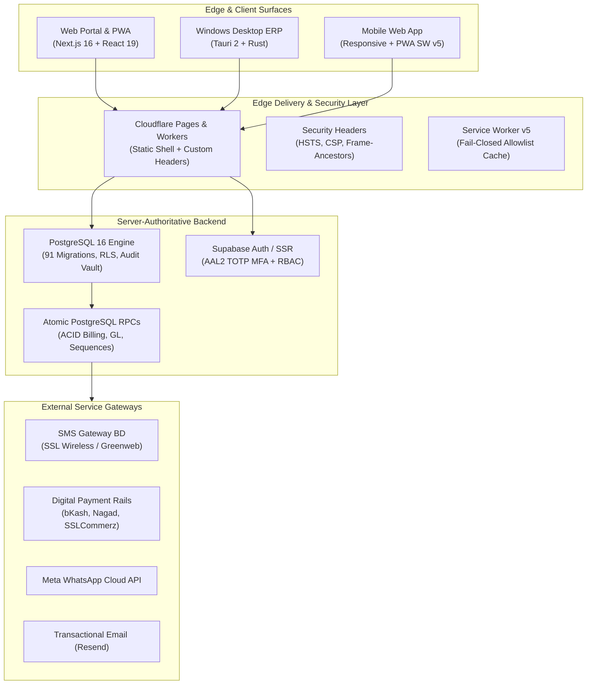

# Onnesha Hospital Management System (OHMS) — Enterprise Specification & World-Class Architecture

## 1. Executive System Topology

The Onnesha Hospital Management System (OHMS) is an enterprise-grade, multi-platform Hospital Information System (HIS) and Electronic Medical Records (EMR) platform built for high-throughput, mission-critical healthcare operations in Bangladesh and internationally.

---

## 2. Core Hospital Modules & Functional Architecture

The system provides 32 functional departments and modules operating across a single unified database:

| Module | Core Functional Capabilities | Security & Clinical Invariants |
| :--- | :--- | :--- |
| **Outpatient Department (OPD)** | Specialist doctor appointments, digital chamber tokens, vitals triage, clinical consultation console, past history review. | Vitals bounds validation (Systolic BP 70-240, SpO2 50-100%); doctor consultation session tracking. |
| **Inpatient Department (IPD)** | Ward & cabin admission, transfer history, discharge summaries, daily doctor rounds, bed occupancy tracking. | Zero double-occupancy on single beds; mandatory admission reason and assigned primary doctor. |
| **Emergency & Casualty** | 24/7 Red/Yellow/Green triage prioritization, rapid admission, resuscitation tracking, temporary trauma IDs (`TEMP-EMG-XXXXX`). | Instant triage sorting by clinical urgency; fail-safe bypass for unverified identity during life-threatening trauma. |
| **Operation Theatre (OT)** | Major/minor surgical scheduling, surgeon and anesthesiologist roster, PAC clearance, post-op recovery notes. | Mandatory pre-anesthesia checkup sign-off; PAC approval prior to surgical incision time. |
| **Pharmacy & POS** | Medicine dispensing, batch expiry management, stock movements, OTC direct cash sales (`PH-SL-XXXXXX`), purchase orders. | **Zero negative stock invariant**: stock decrements reject if requested quantity > on-hand inventory. |
| **Diagnostics & Laboratory** | Test directory, specimen sample collection, barcode tracking (`ORD-XXXXXX`), verified report generation. | Immutable test result locking upon pathologist/doctor sign-off; full audit trail for revisions. |
| **Blood Bank & Transfusion** | Donor screening, blood group inventory (A+, B+, O+, AB+, Rh-neg), cross-matching compatibility, transfusion logs. | Strict ABO/Rh donor-recipient compatibility check before issuing blood units. |
| **Radiology & Imaging** | X-Ray, CT Scan, MRI, Ultrasonography order scheduling, DICOM image attachment, radiologist reporting. | Indicative fee scheduling; verified radiologist sign-off. |
| **Billing & Cashier Desk** | Multi-service invoice generation (`INV-YYYYMM-XXXXX`), partial payments, discounts, refunds, daily cashier shift reconciliation. | **ACID atomic billing + GL post**: invoice creation and GL journal entry post occur in the exact same transaction. |
| **Enterprise General Ledger (GL)** | Chart of accounts (Assets, Liabilities, Equity, Revenue, Expense), double-entry journal entries, real-time trial balance. | Balanced debits and credits invariant (`sum(debits) = sum(credits)`). |
| **Human Resources & Staff** | Doctor roster, nurse shifts, employee profiles (`EMP-XXXX`), biometric attendance reconciliation, payroll salary disbursement. | Strict RBAC permissions; role-based access to salary and employee identification documents. |
| **Fixed Assets & Biomedical** | Biomedical equipment registry, calibration schedules, preventative maintenance logs, asset depreciation. | Service maintenance schedules with alert thresholds before equipment failure. |
| **Central Audit Vault** | Automated forensic event recording, immutable change history, before/after JSON diffs, mandatory clinical void justifications. | Fail-closed logging; cannot be bypassed by unauthenticated users or staff roles. |

---

## 3. Financial Invariants & Integrity Safeguards

1. **Deterministic Business Sequences:**
   - Every invoice, receipt, token, patient code, and journal entry is generated via atomic PostgreSQL database sequences:
     - Patients: `P-YYYYMM-XXXXX`
     - Invoices: `INV-YYYYMM-XXXXX`
     - Receipts: `REC-YYYYMM-XXXXX`
     - OPD Tokens: `OPD-YYYYMM-XXXXX`
     - Journal Entries: `JE-YYYYMM-XXXXX`
2. **Single-Transaction Billing + GL Coupling (`create_invoice_and_post_gl_atomic`):**
   - Invoices are never created without an accompanying double-entry journal voucher posted to the General Ledger. If either operation fails, the entire transaction aborts.
3. **Date Boundary Standardization (Asia/Dhaka BST, UTC+6):**
   - All accounting reports, cash collections, and revenue summaries strictly consume half-open intervals `[startInclusive, endExclusive)` (`created_at >= start AND created_at < endExclusive`), guaranteeing microsecond-accurate reconciliation across midnight transitions.
4. **Mandatory Void Audit Justifications:**
   - Invoices and billing receipts cannot be deleted. Void operations require a clinical/administrative justification (minimum 10 characters) and record the acting user, timestamp, and previous state.

---

## 4. Multi-Platform Deployment Topology

### A. Cloudflare Pages & Workers (Global CDN & Edge Delivery)
- Static export (58 routes, 56 HTML pages) deployed with ultra-low latency.
- Strict security headers configured in `public/_headers` (HSTS, CSP, X-Frame-Options, Cache-Control).
- Fail-closed Service Worker v5 allowlisting public routes and enforcing network-only execution on private routes.

### B. Self-Hosted On-Premise Docker Compose (Edge LAN Hospital Web Server & Auxiliary Replica)
- Production multi-stage `Dockerfile` (Node 22 Alpine builder -> unprivileged Nginx runner).
- `docker-compose.yml` orchestrating `ohms-web` with fail-closed configuration and internal-only network isolation.
- Delivers ultra-fast edge LAN static web serving. The authoritative data, authentication, and storage backend is Supabase Cloud (`iuhtzahuszdkdarhxobx.supabase.co`).
- During cloud internet outages, hospital staff fall back to manual paper continuity protocols (as specified in `docs/PHASE_19_BUSINESS_CONTINUITY.md`), ensuring continuous patient care without false claims of local offline auth/storage parity.

### C. Windows Desktop ERP Client (Tauri 2 + Rust)
- Native Windows 10/11 client application (`src-tauri/`) connecting to the canonical backend.
- Direct thermal POS receipt printing (80mm) and A4 laser printer integration.
- Zero client-side service role secrets; communicates strictly over encrypted TLS.

---

## 5. Security & Compliance Architecture

- **Row Level Security (RLS):** Every PostgreSQL table has RLS enabled with strict `organization_id` tenant isolation.
- **Role-Based Access Control (RBAC):** 8 canonical roles (Super Admin, Hospital Admin, Doctor, Nurse, Pharmacist, Lab Technician, Cashier/Billing, Receptionist) governed by server-side permission matrices.
- **Zero PII/PHI in Telemetry:** Telemetry and error reporting services automatically redact patient codes, National ID (NID) numbers, and financial details.
- **PostgREST Search Filter Sanitization:** Input sanitization removes PostgREST operators, delimiters, and SQL wildcards to eliminate syntax errors and injection vulnerabilities.
