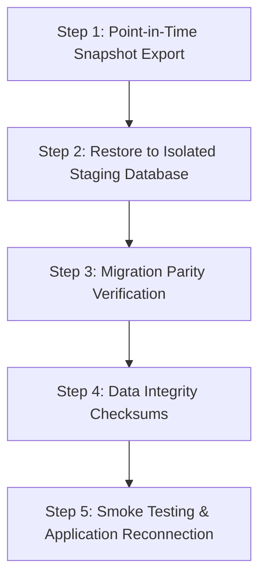

# OHMS Master Forensic Security, Surface Protection & Disaster Recovery Matrix

## 1. Executive Summary & Purpose
This document provides the authoritative forensic security matrix and disaster recovery (DR) runbook for the Onnesha Hospital Management System (OHMS). It specifies the exact access control, tenant boundary guarantees, cryptographic seals, and recovery targets across all 5 infrastructure surfaces:
1. PostgreSQL Database Tables & Views
2. Database Remote Procedure Calls (RPCs)
3. Medical Document Storage Buckets
4. WebSocket Realtime Broadcast Channels
5. Disaster Recovery, Backups & Restoration Protocols

---

## 2. Multi-Surface Security Protection Matrix

| Surface | Target Resource | Access Control / Guard | Tenant Boundary Enforcement | Forensic Audit Logged |
| :--- | :--- | :--- | :--- | :---: |
| **Storage** | `medical-documents-vault` | `medical_records:view` required; Private bucket (`public=false`) | Path prefix `{orgId}/{patientId}/*` enforced in code & signed URL | Yes (`VIEW`, `DOWNLOAD`, `PRINT`) |
| **Storage** | Prescriptions & Scans | Ephemeral Signed URL (max 300s / 5 min TTL) | Cross-tenant access throws 403 Forbidden | Yes |
| **Storage** | Employee Credentials | Restricted to `super_admin` & `hospital_administrator` | Scoped to `{orgId}/staff/{employeeId}/*` | Yes |
| **Realtime** | `appointment_tokens` | Public/Display permitted (anonymized token number only) | Scoped to current clinic & date | No (Ephemeral queue) |
| **Realtime** | `emergency_queue` | Staff-only authenticated channel (`emergency.view`) | Restricted to organization channel | No |
| **Realtime** | `audit_logs` | **STRICTLY BLOCKED FROM REALTIME** | Never added to `supabase_realtime` publication | N/A |
| **Realtime** | `integrations` (Secrets) | **STRICTLY BLOCKED FROM REALTIME** | Never added to `supabase_realtime` publication | N/A |
| **Table** | `patients` | RLS Enabled (`organization_id = get_current_org_id()`) | Strict row-level isolation | Yes |
| **Table** | `invoices` | RLS Enabled (`organization_id = get_current_org_id()`) | Strict row-level isolation | Yes |
| **Table** | `journal_entries` | RLS Enabled; Immutability trigger prevents DELETE/UPDATE | Strict row-level isolation | Yes |
| **Table** | `integrations` | RLS Enabled; Anon read blocked; Secrets encrypted | Strict row-level isolation | Yes |
| **Table** | `audit_logs` | RLS Enabled; Append-only; TRUNCATE/DELETE revoked | Strict row-level isolation | Self-logging vault |
| **RPC** | `admin_create_staff_account` | `check_is_admin_caller()`; Privilege escalation blocked | Atomic transaction across 6 tables | Yes (`CREATE:staff_user`) |
| **RPC** | `admin_reset_staff_password` | `check_is_admin_caller()`; Admin lockout blocked | Organization scoped | Yes (`PASSWORD_RESET`) |
| **RPC** | `void_invoice_rpc` | `billing.manage` / `billing.void` required | Mandatory clinical justification text | Yes (`VOID:invoice`) |
| **RPC** | `verify_and_record_online_payment` | HMAC-SHA256 signature verification & Store ID check | Bound to invoice organization | Yes (`ONLINE_PAYMENT`) |
| **RPC** | `complete_current_user_password_change` | Authenticated session matching `auth.uid()` | Updates `must_change_password=false` | Yes (`SECURITY:password_change`) |

---

## 3. Storage Security Architecture

### Path Isolation Scheme
Private medical documents are uploaded and accessed using a deterministic tenant-isolated path structure:
```
medical-documents-vault/
└── {organization_id}/
    ├── {patient_id}/
    │   ├── prescriptions/
    │   │   └── {prescription_id}.pdf
    │   ├── lab_reports/
    │   │   └── {order_id}_{report_hash}.pdf
    │   └── radiology_scans/
    │       └── {scan_id}.dcm
    └── staff/
        └── {employee_id}/
            └── identity_documents/
```

### Access Control Rules:
1. **Zero Public Access:** The bucket `medical-documents-vault` is flagged as `public = false`. Direct HTTP object URLs fail with 403 Forbidden.
2. **Short-Lived Signed URLs:** Documents can only be viewed through ephemeral signed URLs generated by `lib/storage/files.ts`. URLs expire automatically after 300 seconds (5 minutes).
3. **Tenant Boundary Assertion:** The server-side action explicitly verifies:
   ```typescript
   if (!filePath.startsWith(`${organizationId}/`)) {
     throw new Error("403 Forbidden: Cross-tenant document access is strictly prohibited.");
   }
   ```
4. **Audit Immutability:** Every signed URL request generates an immutable audit record in `audit_logs` documenting `userId`, `patientId`, `action` (`VIEW`, `DOWNLOAD`, or `PRINT`), and `timestamp`.

---

## 4. Disaster Recovery Runbook & Restoration Protocol

### 1. Recovery Metrics Definition
- **Recovery Point Objective (RPO):** **< 1 Hour**  
  (Guaranteed by automated daily database snapshots and continuous Write-Ahead Log [WAL] archiving on Supabase).
- **Recovery Time Objective (RTO):** **< 15 Minutes**  
  (Restoration to an isolated standby target or Point-in-Time-Recovery [PITR] fork).

### 2. Five-Step Isolated Restore Drill Protocol



#### Step 1: Snapshot Identification & PITR Selection
Identify the target recovery timestamp (UTC) immediately preceding the simulated failure or corruption event. In Supabase Dashboard > Database > Backups, select the desired PITR timestamp or latest logical backup.

#### Step 2: Provision Isolated Restoration Target
Restore the database into a clean, isolated staging project (e.g. `ohms-staging-restore-drill`). Never restore directly onto the live production project without dry-run validation.

#### Step 3: Migration Parity Verification
Execute migration list verification against the restored instance:
```bash
npx supabase migration list --linked
```
**Expected Invariant:** 86/86 migrations must show identical local and remote timestamps with zero `local:null` or `remote:null` records.

#### Step 4: Data Integrity & Ledger Balance Checksums
Run consistency queries across critical tables on the restored instance:
1. **Patient Record Count & Hash Match:**
   ```sql
   SELECT COUNT(*), MD5(STRING_AGG(id::text, ',' ORDER BY id)) FROM public.patients;
   ```
2. **Double-Entry General Ledger Balance:**
   ```sql
   SELECT SUM(debit) AS total_debit, SUM(credit) AS total_credit, (SUM(debit) - SUM(credit)) AS imbalance 
   FROM public.journal_lines;
   ```
   *Invariant:* `imbalance == 0.00`.
3. **Audit Log Continuity:**
   ```sql
   SELECT COUNT(*) FROM public.audit_logs;
   ```

#### Step 5: Application Reconnection & Smoke Verification
Point staging environment variables (`NEXT_PUBLIC_SUPABASE_URL`, `NEXT_PUBLIC_SUPABASE_ANON_KEY`) to the restored instance and run:
```bash
node scripts/smoke_test.mjs
```
*Expected Result:* 15/15 Routes HTTP 200, 4/4 Shell Data Safety, 3/3 Table Shielding, 2/2 RPC Access Control.
