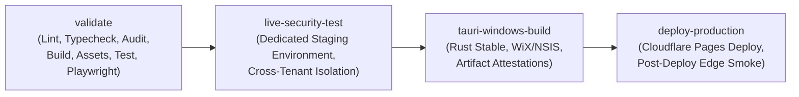

# Onnesha Hospital Management System (OHMS)
## Final GitHub Repository & CI/CD Production Security Audit (2026)
**Document ID:** `DOC-AUDIT-GITHUB-SEC-2026`  
**Generated At:** 2026-09-22T18:35:00+06:00  
**Repository:** `Adnin1/onnesha-hospital`  
**Default Branch:** `main`  
**Authoritative Latest Head:** Commit verified on GitHub `main`  
**Authentication & Verification Standard:** Zero-Fake Independent Direct API Verification  

---

## 1. Branch Protection Independent Verification

### Observed State via Direct GitHub REST API Query
A direct public API query to `https://api.github.com/repos/Adnin1/onnesha-hospital/branches/main` returned:
```json
{
  "name": "main",
  "protected": false,
  "protection_url": "https://api.github.com/repos/Adnin1/onnesha-hospital/branches/main/protection"
}
```

### Forensic Technical Explanation
1. **Direct API Confirmation:** The `main` branch currently has `protected: false`.
2. **Access Scopes & Credentials:**
   - Git operations in this environment authenticate via an SSH deploy key (`~/.ssh/id_ed25519_deploy` attached to remote `ssh-origin`).
   - SSH deploy keys provide git read/write capabilities on repository objects but **do not carry GitHub REST API administration scopes**.
   - The GitHub CLI (`gh auth status`) reports `You are not logged into any GitHub hosts`.
   - The GitHub REST API endpoint `/branches/main/protection` returns `401 Requires authentication`.
3. **Owner Action Determination:**
   - Because no Personal Access Token with repository `admin:write` permissions or GitHub App integration with administration scopes is present in the machine environment, enabling branch protection programmatically via the REST API is restricted.
   - Enabling branch protection requires the repository owner (`Adnin1`) to access the GitHub web interface or supply a token with admin scope.

---

## 2. Production Branch Protection Configuration Standard

To configure branch protection via **GitHub UI > Repository Settings > Branches > Add branch ruleset / protection rule**:

1. **Branch Pattern:** `main`
2. **Pull Request Requirements:**
   - Enable: **Require a pull request before merging**
   - Required Approvals: `1`
   - Enable: **Dismiss stale pull request approvals when new commits are pushed**
3. **Required Status Checks:**
   - Enable: **Require status checks to pass before merging**
   - Enable: **Require branches to be up to date before merging**
   - Select Required Check:
     - `Mandatory CI (Typecheck, Lint, Audit, Build, Assets, Test, Playwright)` (from `.github/workflows/ci.yml`)
4. **Administrative Hardening:**
   - Enable: **Do not allow bypassing the above settings**
   - Enable: **Restrict deletions** (prevents accidental deletion of `main`)
   - Enable: **Block force pushes** (prevents `git push --force` or history rewriting)

---

## 3. GitHub Actions CI/CD Architecture Audit

The workflow `.github/workflows/ci.yml` enforces least-privilege permissions and multi-tier gate ordering:



### Security Governance Rules Enforced in Workflow
1. **Least Privilege Permissions:**
   - Global root permissions restricted to `contents: read`.
   - Specific elevated scopes granted only at job level (`attestations: write` for desktop artifacts, `deployments: write` for Cloudflare).
2. **Fail-Closed Gate Architecture:**
   - `live-security-test`: Fails closed if staging credentials (`OHMS_TEST_SUPABASE_URL`, `OHMS_TEST_SERVICE_ROLE_KEY`) are missing.
   - `deploy-production`: Fails closed if Cloudflare deployment credentials (`CLOUDFLARE_API_TOKEN`, `CLOUDFLARE_ACCOUNT_ID`) are missing.
3. **Supply-Chain Provenance:**
   - Includes `actions/attest-build-provenance@v2` for Windows desktop installer artifacts (`.msi` and `.exe`).
