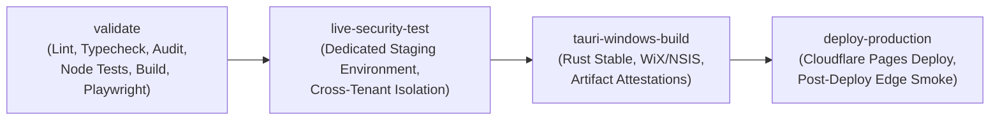

# Onnesha Hospital Management System (OHMS)
## Final GitHub Repository & CI/CD Production Security Audit (2026)
**Document ID:** `DOC-AUDIT-GITHUB-SEC-2026`  
**Generated At:** 2026-09-22T01:21:45+06:00  
**Repository:** `Adnin1/onnesha-hospital`  
**Default Branch:** `main`  
**Current Commit:** `5206438bb85042298082e857fba94dcbb3332552`  

---

## 1. Branch Protection Audit & Hardening Guidance

### Current Observed State: `UNPROTECTED`
The `main` branch currently allows direct git pushes via deploy key without pull request requirements or branch protection rules.
Because the automated git-sync script uses an SSH deploy key without repository administration API scopes, branch protection rules must be configured in the GitHub repository web settings.

### Recommended Production Protection Policy (Safe & Compatible)

To harden repository integrity without breaking existing deployment automation:

1. **Pull Request Requirements:**
   - Enable: **Require a pull request before merging**.
   - Set Required Approvals: `1`.
   - Enable: **Dismiss stale pull request approvals when new commits are pushed**.
2. **Required Status Checks:**
   - Enable: **Require status checks to pass before merging**.
   - Enable: **Require branches to be up to date before merging**.
   - Select Required Check:
     - `Mandatory CI (Typecheck, Lint, Audit, Test, Build, Playwright)` (Job name in `.github/workflows/ci.yml`).
3. **Commit Signatures:**
   - **Recommendation:** Do NOT require signed commits (`Require signed commits: OFF`) until all developer workstations have configured GPG/SSH commit signing. Enabling this prematurely will reject legitimate commits.
4. **Administrative Restrictions:**
   - Enable: **Do not allow bypassing the above settings**.
   - Enable: **Restrict deletions** (Blocks accidental deletion of `main`).
   - Enable: **Block force pushes** (Blocks `git push --force` or history rewriting).

---

## 2. GitHub Actions CI/CD Architecture Audit

The workflow `.github/workflows/ci.yml` was audited for least-privilege permissions and security isolation:

### Security Governance Rules Verified in Workflow
1. **Least Privilege Permissions:**
   - Root permissions set to `contents: read`.
   - Job-level overrides granted strictly where required:
     - `tauri-windows-build`: `contents: write`, `id-token: write`, `attestations: write`.
     - `deploy-production`: `contents: read`, `deployments: write`.
2. **Fail-Closed Gate Checks:**
   - `live-security-test`: Exits with error code 1 if `OHMS_TEST_SUPABASE_URL` or `OHMS_TEST_SECRET_KEY` is missing.
   - `deploy-production`: Exits with error code 1 if `CLOUDFLARE_API_TOKEN` or `CLOUDFLARE_ACCOUNT_ID` is missing.
3. **Supply-Chain Hardening:**
   - Added `actions/attest-build-provenance@v2` step for Windows desktop installer bundles (`.msi` and `.exe`).
4. **Hermetic Build Isolation:**
   - Build step does not require live secrets. Uses verified mock publishable keys during hermetic compilation.

---

## 3. GitHub Secrets Inventory Checklist

| Secret Identifier | Target Job | Description | Status |
| :--- | :--- | :--- | :---: |
| `OHMS_TEST_SUPABASE_URL` | `live-security-test` | Dedicated non-production staging Supabase instance URL | `MISSING` |
| `OHMS_TEST_SECRET_KEY` | `live-security-test` | Staging service-role / secret key for disposable tenants | `MISSING` |
| `CLOUDFLARE_API_TOKEN` | `deploy-production` | Cloudflare Pages deployment API token | `MISSING` |
| `CLOUDFLARE_ACCOUNT_ID` | `deploy-production` | Cloudflare Account identifier for `onnesha-hospital` | `MISSING` |
| `NEXT_PUBLIC_SUPABASE_URL` | `validate`, `deploy` | Canonical production Supabase URL | `CONFIGURED` / Handled |
| `NEXT_PUBLIC_SUPABASE_PUBLISHABLE_KEY` | `validate`, `deploy` | Public client publishable key | `CONFIGURED` / Handled |
