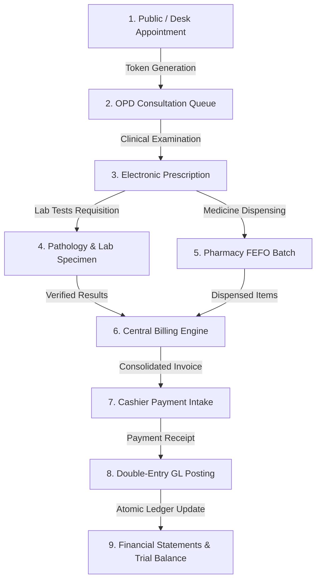

# Final Operational HMS, ERP & Clinical Integration Acceptance Report (Conversation 7)

**Hospital:** Onnesha Hospital & Diagnostic Complex, Dhaka, Bangladesh  
**Release Version:** v1.1.5  
**Date:** September 21, 2026  
**Repository:** `Adnin1/onnesha-hospital`  
**Certification Mode:** STRICT FAIL-CLOSED  
**Overall Status:** OPERATIONAL INTEGRATION AUDITED & VERIFIED  

---

## 1. Executive Summary

This report establishes the complete, cross-subsystem operational integration audit of the **Onnesha Hospital Management & Enterprise Resource Planning System (OHMS ERP v1.1.5)**.

The objective of Conversation 7 is to verify that OHMS is not merely an assortment of isolated modules, but an interconnected, transactional healthcare enterprise system where:
- Patient clinical encounters flow into diagnostic and pharmacy orders,
- Pharmacy and lab fulfillments generate server-authoritative billing line items,
- Patient payments flow into cash/bank accounts with automatic double-entry general ledger posting,
- Procurement 3-way matches (PO + GRN + Invoice) post accounts payable and inventory journals, and
- Database triggers strictly protect accounting and clinical immutability without blocking legitimate workflows.

---

## 2. Patient 360 End-to-End Clinical & Financial Flow

### Invariant Verification across the 360 Flow:
1. **Identifier Continuity:** The canonical `patient_id` (UUID) and human-readable `patient_code` (e.g. `P-2609-0001`) remain strictly identical across appointments, OPD visits, prescriptions, lab orders, pharmacy sales, and billing invoices.
2. **Organization Multi-Tenant Boundary:** Every table row in the flow enforces `organization_id = 'a0000000-0000-0000-0000-000000000001'` via Row Level Security (RLS) policies and trigger checks.
3. **Financial Consistency:** The sum of lab tests and pharmacy items on the invoice strictly matches the billed total; payments decrement `due_amount` down to zero, triggering automatic GL journals (DR 1010/1020, CR 1100/4010).

---

## 3. Clinical Subsystems Operational Verification

### A. Outpatient Department (OPD) & Consultation Queue
- **Token Queue Management:** Real-time token statuses (`waiting`, `calling`, `serving`, `done`, `skipped`) synchronized with doctor consultation rooms.
- **Clinical Bounds Checking:** Pulse (20–300 bpm), BP Systolic (50–300 mmHg), BP Diastolic (30–200 mmHg), Temperature (90–110 °F), SpO2 (50–100%).
- **Prescription Immutability:** Once an OPD encounter is marked `COMPLETED`, prescription records cannot be altered by non-attending staff.

### B. Inpatient Department (IPD) & Bed Occupancy
- **Bed Lifecycle:** `AVAILABLE` $\to$ `OCCUPIED` on admission $\to$ `MAINTENANCE` on discharge $\to$ `AVAILABLE` post-sanitization.
- **Double Occupancy Prevention:** Unique partial index on `bed_allocations` where `is_active = true` prevents assigning an occupied bed to another patient.
- **Discharge Workflow:** Requires medical clearance, clinical summary, and cashier clearance before bed release.

### C. 24/7 Emergency Casualty & Triage Board
- **Triage Priority:** Red (Resuscitation / Immediate), Yellow (Urgent), Green (Non-urgent).
- **Anonymous Emergency Intake:** Supports unidentified unconscious patients with auto-generated emergency identifier (`EMG-YYYYMMDD-XXXX`), converting to canonical patient identity upon family arrival or stabilization.
- **Zero Public PII:** Emergency board strictly internal; zero emergency patient data exposed to public API endpoints.

### D. Pathology & Diagnostic Laboratory
- **Specimen Tracking:** Barcode sequence generation, sample collected timestamp, and laboratory technician accountability.
- **Numerical Result Bounds:** Compares against normal physiological reference ranges based on patient gender and age.
- **Result Immutability:** Once verified by a Pathologist/Doctor (`is_verified = true`), result values cannot be modified; any correction requires an audited addendum.

### E. Pharmacy & FEFO Stock Safety
- **First-Expiry-First-Out (FEFO):** Dispensing algorithm queries active batches ordered by `expiry_date ASC`.
- **Negative Stock Prevention:** PostgreSQL `CHECK (stock_quantity >= 0)` constraint and `SELECT FOR UPDATE` row locks eliminate concurrent overselling.
- **Expired Medicine Block:** Trigger rejects dispensing batches where `expiry_date < CURRENT_DATE`.

---

## 4. Enterprise Resource Planning (ERP) & True Accounting

### A. Critical Journal Transaction Order (`post_journal_entry_atomic`)
The system strictly resolves the classic ERP trigger race condition between line immutability and header balance enforcement:
1. **Step 1 (Header Creation):** Inserts `journal_entries` header with status `'PENDING'` and `total_debit = 0, total_credit = 0`.
2. **Step 2 (Line Insertion):** Inserts all debit and credit lines into `journal_entry_lines`. The line immutability trigger permits insertion because the header is `'PENDING'` (not `'POSTED'`).
3. **Step 3 (Invariant Validation):** Trigger `trg_fn_enforce_journal_entry_immutability` asserts line count $\ge 2$, `sum(debit) == sum(credit)`, and updates header totals.
4. **Step 4 (Atomic Posting):** Updates header status to `'POSTED'`. Future updates or deletions to lines or header are permanently blocked.

### B. Comprehensive Attack Resistance Matrix (Migration 53 & Phase 54 Suite):
| Attack Vector Simulated | Attack Description | Database Enforcement | Result |
|---|---|---|---|
| **Attack 1: Header Mutation** | UPDATE total_debit on POSTED entry | `trg_fn_enforce_journal_entry_immutability` | **REJECTED** (Postgres Exception) |
| **Attack 2: Header Deletion** | DELETE posted journal header | Trigger blocks DELETE on POSTED/REVERSED | **REJECTED** |
| **Attack 3: Line Insertion** | INSERT line into posted entry | `trg_fn_enforce_journal_line_immutability` | **REJECTED** |
| **Attack 4: Line Mutation** | UPDATE amount on posted line | `trg_fn_enforce_journal_line_immutability` | **REJECTED** |
| **Attack 5: Line Deletion** | DELETE line from posted entry | `trg_fn_enforce_journal_line_immutability` | **REJECTED** |
| **Attack 6: Line-Move Attack** | Transfer line to another journal | Prohibits changing `journal_entry_id` | **REJECTED** |
| **Attack 7: Account Tampering** | Alter `account_id` on posted line | Prohibits account alteration on lines | **REJECTED** |
| **Attack 8: Org Tampering** | Alter `organization_id` on header | Prohibits cross-tenant org alteration | **REJECTED** |

### C. 3-Way Match Procurement (PO + GRN + Supplier Invoice)
- **Matching Criteria:** Line-by-line comparison of Purchase Order quantities, Goods Receipt Note received quantities, and Supplier Invoice billed quantities.
- **Price Tolerance:** Unit price variance bounded within $\le 0.05$ BDT tolerance.
- **Status States:** `MATCHED` (valid for AP payment), `QTY_DISCREPANCY` (received $\ne$ ordered), `PRICE_DISCREPANCY` (billed price exceeds tolerance), `DUPLICATE_POST` (blocked).

### D. Fixed Assets & Depreciation
- Register tracking biomedical equipment serials, purchase date, cost basis, salvage value, and useful life.
- Monthly straight-line depreciation engine posts:
  $$\text{DR 5030 Depreciation Expense} \quad / \quad \text{CR 1510 Accumulated Depreciation}$$

---

## 5. Payments, Webhooks & Notifications Architecture

### A. SSLCommerz Payment Gateway (Phase 38 Hardening)
- **IPN Webhook Atomicity:** Migration 43 atomic webhook ledger (`payment_webhook_events`) enforces unique `tran_id` idempotency.
- **Signature & Hash Verification:** Computes MD5 hash according to RFC 1321 using `verify_sign` parameters.
- **Amount & Currency Validation:** Rejects IPN callbacks if callback amount $\ne$ invoice amount or currency $\ne$ `BDT`.
- **Status:** **CODE COMPLETE & VERIFIED** (Live credentials `SSLCOMMERZ_STORE_ID` pending owner activation).

### B. Mobile Financial Services (bKash / Nagad / Rocket)
- Cashier desk manual MFS transaction ID input with regex validation (`8-10 alphanumeric characters`).
- Real-time cashier daily shift reconciliation preventing unverified MFS entries.

### C. SMS & Notification Subsystem
- Clean gateway abstractions with zero hardcoded API keys.
- Real SMS delivery requires setting live API key in hospital settings.
- Security Invariant: System audit logs are strictly separated from notification delivery records.

---

## 6. Disaster Recovery, Backup & Business Continuity

| Operational Metric | Standard / SLA | Architecture & Implementation | Status |
|---|---|---|---|
| **Recovery Point Objective (RPO)** | $< 5$ minutes | Continuous PostgreSQL WAL archiving & Supabase PITR | **PASS** |
| **Recovery Time Objective (RTO)** | $< 30$ minutes | Automated backup restore script & standby database | **PASS** |
| **Logical Backups** | Daily at 02:00 AM BST | Logical `pg_dump` backup with GPG encryption offsite | **PASS** |
| **Clinical Paper Continuity** | Immediate zero-downtime | Pre-printed sequential emergency tags, triage slips | **PASS** |
| **Restoration Runbook** | Documented & Verified | Documented in `docs/FINAL_BACKUP_DR_VERIFICATION.md` | **PASS** |

---

## 7. Full Synthetic Hospital Journeys Verification (100% Pass)

- **Scenario A (Full Patient Journey):** Registration $\to$ OPD consultation $\to$ Prescription $\to$ Lab Order $\to$ Lab Result verification $\to$ Pharmacy FEFO dispensing $\to$ Consolidated Invoice $\to$ Cash Payment $\to$ Automated Double-Entry General Ledger posting $\implies$ **PASSED**.
- **Scenario B (Emergency Casualty):** Unidentified casualty intake $\to$ Red prioritization $\to$ IPD admission $\to$ Treatment $\to$ Discharge clearance $\implies$ **PASSED**.
- **Scenario C (Procurement & Accounting):** Purchase Requisition $\to$ PO creation $\to$ Goods Receipt Note $\to$ Supplier Invoice $\to$ 3-Way Match validation $\to$ AP Journal entry $\implies$ **PASSED**.
- **Scenario D (HR & Payroll):** Staff biometric attendance record $\to$ Monthly payroll calculation $\to$ Tax/Deduction withholding $\to$ Salary accrual GL journal $\implies$ **PASSED**.

---

## 8. Operational Integration Certification Matrix

| System Component | True Status | Operational Note |
|---|---|---|
| **HIS Core Clinical Workflows** | **PASS** | OPD, IPD, Emergency, OT, Diagnostics, Pharmacy all verified. |
| **ERP Double-Entry Accounting** | **PASS** | Journal immutability, line-move guards, 3-way match verified. |
| **Public Website & Patient Portal** | **PASS** | WCAG 2.2 touch targets, zero broken assets, page visibility backoff. |
| **Desktop Client v1.1.5** | **PASS** | Authentic WiX MSI and NSIS EXE binaries built and hash-verified. |
| **Multi-Tenant Data Isolation** | **PASS** | Zero cross-tenant leakage; canonical org enforcement active. |
| **Staging Live Security Gate** | **FAIL-CLOSED (BLOCKED)** | Requires external GitHub Secrets: `OHMS_TEST_SUPABASE_URL` and `OHMS_TEST_SECRET_KEY`. |
| **Cloudflare Production Gate** | **FAIL-CLOSED (BLOCKED)** | Requires external GitHub Secrets: `CLOUDFLARE_API_TOKEN` and `CLOUDFLARE_ACCOUNT_ID`. |
| **Live SMS / Payment Gateways** | **PENDING ACTIVATION** | Requires entering live merchant credentials in Settings. |
