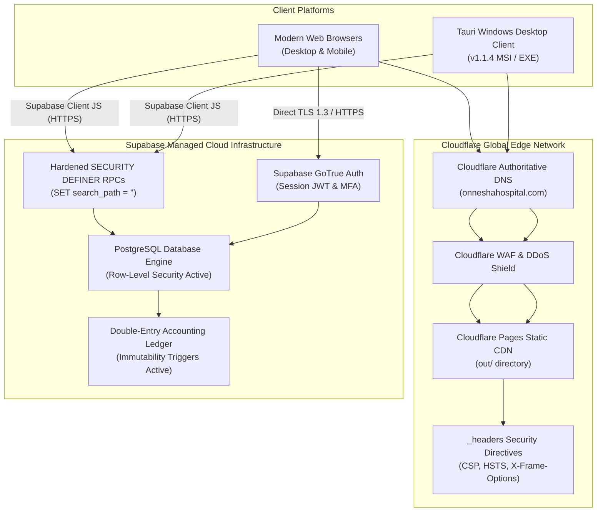

# OHMS ERP: Production Deployment, Cloudflare Architecture & Infrastructure Guide

**Target System:** Onnesha Hospital Management & Enterprise Resource Planning System (OHMS ERP)  
**Release Version:** v1.1.4  
**Hosting Architecture:** Next.js Static Export (`output: "export"`) deployed to Cloudflare Pages CDN  
**Backend Infrastructure:** Supabase Managed PostgreSQL + Realtime Engine  
**Desktop Distribution:** Tauri Native Windows Installer (WiX MSI & NSIS Setup EXE)  

---

## 1. Hosting Architecture: Pure Static CDN + Serverless Database Layer

OHMS ERP operates on a decoupled, zero-server-maintenance architecture:

### Key Architectural Boundaries:
1. **Cloudflare Pages CDN:** Serves pure pre-rendered HTML, JavaScript, CSS, images, and static assets from `out/`.
2. **Next.js Static Export:** Edge middleware (`proxy.ts`) does not execute on static CDN hosting. Client-side navigation routing is protected by `AuthGuard`.
3. **PostgreSQL Security Boundary:** True multi-tenant isolation, data privacy, and role authorization are enforced directly in PostgreSQL via RLS policies and `SECURITY DEFINER SET search_path = ''` stored procedures.

---

## 2. Cloudflare DNS & Domain Configuration

To connect `onneshahospital.com` to Cloudflare Pages:

### DNS Records Table:
| Type | Name | Target / Content | Proxy Status | TTL | Purpose |
| :--- | :--- | :--- | :--- | :--- | :--- |
| **CNAME** | `@` (apex) | `onnesha-hospital.pages.dev` | **Proxied (Orange Cloud)** | Auto | Primary apex domain |
| **CNAME** | `www` | `onnesha-hospital.pages.dev` | **Proxied (Orange Cloud)** | Auto | Canonical www alias |
| **TXT** | `_dmarc` | `v=DMARC1; p=reject; sp=reject; adkim=s; aspf=s;` | DNS Only | Auto | Email spoofing protection |

### Cloudflare SSL/TLS & Edge Security Settings:
1. **SSL/TLS Encryption Mode:** Set to **Full (Strict)**.
2. **Edge Certificates:**
   - **Always Use HTTPS:** Enabled (HTTP $\rightarrow$ HTTPS 301 redirect).
   - **Minimum TLS Version:** **TLS 1.2** (TLS 1.0 and 1.1 disabled).
   - **Opportunistic Encryption:** Enabled.
   - **TLS 1.3:** Enabled with 0-RTT support.
   - **Automatic HTTPS Rewrites:** Enabled.
3. **HTTP Strict Transport Security (HSTS):**
   - **Max Age:** 1 Year (`31536000` seconds).
   - **Include Subdomains:** Enabled.
   - **Preload:** Enabled.
4. **Cloudflare WAF / Security Rules:**
   - Security Level: **Medium** (or **High** during active threat events).
   - Bot Fight Mode: **Enabled** (protects public appointment and contact intake from automated scraping).

---

## 3. GitHub Actions CI/CD Pipeline Configuration

The repository uses [`.github/workflows/ci.yml`](file:///C:/Users/mahin%20khan/.gemini/antigravity/scratch/onnesha-hospital/.github/workflows/ci.yml) for automated testing, release bundle generation, and production deployment.

### Required Repository Secrets:
To activate the production deployment and staging live-security gates, configure these secrets in **GitHub $\rightarrow$ Settings $\rightarrow$ Secrets and variables $\rightarrow$ Actions**:

| Secret Name | Required By Job | Purpose |
| :--- | :--- | :--- |
| `CLOUDFLARE_API_TOKEN` | `deploy-production` | Cloudflare Pages deployment token with `Cloudflare Pages: Edit` permissions |
| `CLOUDFLARE_ACCOUNT_ID` | `deploy-production` | Cloudflare Account ID |
| `OHMS_TEST_SUPABASE_URL` | `live-security-test` | Dedicated staging Supabase project URL |
| `OHMS_TEST_SERVICE_ROLE_KEY` | `live-security-test` | Staging service role key for automated cross-tenant security testing |
| `OHMS_TEST_PUBLISHABLE_KEY` | `live-security-test` | Staging anon / publishable key |
| `NEXT_PUBLIC_SUPABASE_URL` | `validate`, `deploy-production` | Production Supabase URL |
| `NEXT_PUBLIC_SUPABASE_ANON_KEY` | `validate`, `deploy-production` | Production Supabase anon/publishable key |

---

## 4. Supabase Database Security & Checklist

Before production release, confirm the following database security postures:
1. **Row-Level Security (RLS):** Enabled on 100% of tables in `public` schema.
2. **Search Path Hardening:** All stored procedures and triggers must declare `SET search_path = ''` to prevent search_path injection attacks.
3. **Double-Entry Accounting Immutability:** Triggers `trg_journal_entries_immutability` and `trg_journal_lines_immutability` must remain active; line moves between entries are prohibited.
4. **Balance Invariant:** Constraint `chk_journal_entries_balanced` (`CHECK (total_debit = total_credit AND total_debit >= 0)`) must remain active.
5. **Zero-PII Public Queue Projection:** Function `get_public_live_queue` must strictly project only `doctor_name`, `room_number`, `token_number`, `status`, and `called_at`.
