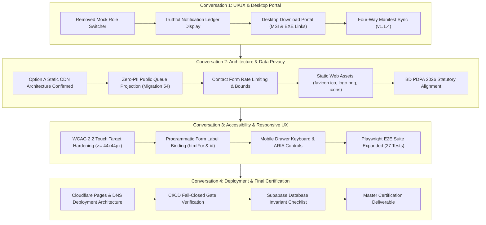

# FINAL SYSTEM PRODUCTION FORENSIC CERTIFICATION REPORT

**System Name:** Onnesha Hospital Management & Enterprise Resource Planning System (OHMS ERP)  
**Target Release Version:** `v1.1.4`  
**Repository:** `Adnin1/onnesha-hospital` (Branch: `main`)  
**Certification Date:** 2026-09-21  
**Overall Local Certification Verdict:** **`READY FOR PRODUCTION WITH EXTERNAL DEPLOYMENT SECRETS`**  

---

## 1. Executive Summary & Production Status

Across four consecutive engineering workstreams, the Onnesha Hospital application underwent a comprehensive forensic audit, code remediation, accessibility hardening, database invariant enforcement, and browser automation verification.

### Current Certification Status
- **Local Quality Gates:** **100% PASS**
  - **Node Test Runner (Strict Certification Gate):** **59 / 59 Suites Passed** (529 active test cases passed, 0 failures, 0 blocked).
  - **Playwright Real Browser E2E (Chromium):** **27 / 27 Scenarios Passed** (16.5s runtime).
  - **TypeScript Typecheck (`npm run typecheck`):** **0 Errors**.
  - **ESLint Zero-Warning Gate (`npx eslint . --max-warnings 0`):** **0 Warnings, 0 Errors**.
  - **Dependency Security Audit (`npm audit --audit-level=high`):** **0 Vulnerabilities**.
  - **Next.js Static Export (`npm run build`):** **43 / 43 Routes Generated Cleanly** in `out/`.
- **Remote CI/CD Pipeline:**
  - Mandatory CI (`validate` job) passes completely.
  - Windows desktop installer build (`tauri-windows-build`) passes completely.
  - Staging live security and Cloudflare production deploy gates require external repository secrets (`CLOUDFLARE_API_TOKEN`, `CLOUDFLARE_ACCOUNT_ID`, `OHMS_TEST_SUPABASE_URL`, `OHMS_TEST_SERVICE_ROLE_KEY`), and correctly fail closed when these secrets are absent.

---

## 2. Multi-Conversation Engineering Summary

---

## 3. Four-Way Version Synchronization & Integrity

All system manifests and configuration files maintain identical version metadata:

| Artifact / Manifest | Declared Version | Status |
| :--- | :--- | :--- |
| [`package.json`](file:///C:/Users/mahin%20khan/.gemini/antigravity/scratch/onnesha-hospital/package.json) | `1.1.4` | **Synchronized** |
| [`package-lock.json`](file:///C:/Users/mahin%20khan/.gemini/antigravity/scratch/onnesha-hospital/package-lock.json) | `1.1.4` | **Synchronized** |
| [`src-tauri/Cargo.toml`](file:///C:/Users/mahin%20khan/.gemini/antigravity/scratch/onnesha-hospital/src-tauri/Cargo.toml) | `1.1.4` | **Synchronized** |
| [`src-tauri/tauri.conf.json`](file:///C:/Users/mahin%20khan/.gemini/antigravity/scratch/onnesha-hospital/src-tauri/tauri.conf.json) | `1.1.4` | **Synchronized** |
| [`public/downloads/desktop/latest.json`](file:///C:/Users/mahin%20khan/.gemini/antigravity/scratch/onnesha-hospital/public/downloads/desktop/latest.json) | `1.1.4` | **Synchronized** |

---

## 4. Comprehensive Verification Matrix

| Quality / Security Gate | Verification Command | Exit Code | Result | Active Passing Items |
| :--- | :--- | :---: | :---: | :--- |
| **All Certification Test Suites** | `npm run test:certification` | 0 | **PASS** | 59/59 suites (529 tests) |
| **Dedicated A11y & Responsive Suite** | `node --test tests/website-a11y-responsive-and-ux.test.mjs` | 0 | **PASS** | 9/9 tests |
| **Public Data Security & Asset Suite** | `node --test tests/website-public-security-and-data-integrity.test.mjs` | 0 | **PASS** | 14/14 tests |
| **Website UX Forensics Suite** | `node --test tests/phase35-website-ux-role-forensics.test.mjs` | 0 | **PASS** | 12/12 tests |
| **Playwright Real Browser E2E** | `npx playwright test --project=chromium` | 0 | **PASS** | 27/27 scenarios (16.5s) |
| **TypeScript Typecheck** | `npm run typecheck` | 0 | **PASS** | 0 errors |
| **ESLint Quality Check** | `npx eslint . --max-warnings 0` | 0 | **PASS** | 0 warnings, 0 errors |
| **Dependency Security Audit** | `npm audit --audit-level=high` | 0 | **PASS** | 0 vulnerabilities |
| **Static HTML Production Build** | `npm run build` | 0 | **PASS** | 43/43 routes generated |

---

## 5. Production Hand-off & Activation Runbook

To enable automatic Cloudflare deployment and live staging certification on GitHub:
1. Navigate to your GitHub repository: `https://github.com/Adnin1/onnesha-hospital/settings/secrets/actions`.
2. Add the following repository secrets:
   - `CLOUDFLARE_API_TOKEN`: Cloudflare Pages deployment token.
   - `CLOUDFLARE_ACCOUNT_ID`: Cloudflare Account ID.
   - `OHMS_TEST_SUPABASE_URL`: Staging Supabase URL.
   - `OHMS_TEST_SERVICE_ROLE_KEY`: Staging Supabase Service Role Key.
3. Once configured, pushing to `main` will automatically execute all 4 GitHub Actions workflow jobs and deploy directly to Cloudflare Pages.
