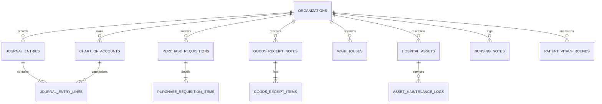

# Onnesha Hospital Management System (OHMS) - Enterprise ERP Architecture

## 1. Executive Summary & ERP Paradigm Shift

**Onnesha Hospital (OHMS)** has evolved from a clinical Hospital Management System (HMS) into a comprehensive, multi-tenant **Hospital Enterprise Resource Planning (ERP)** platform.

### Core ERP Architecture Tenets
1. **Strict Double-Entry General Ledger:**
   Every financial event (OPD billing, inpatient advance, pharmacy POS sale, supplier procurement receipt, payroll disbursement) conforms to the fundamental accounting equation:
   $$\text{Assets} = \text{Liabilities} + \text{Equity}$$
   All journal entries enforce the invariant:
   $$\sum \text{Debit} = \sum \text{Credit} > 0$$
   Enforced both client-side and at the PostgreSQL kernel level via atomic RPC `public.post_journal_entry_atomic`.

2. **Supply Chain & Procurement Lifecycle:**
   Clinical departments issue digital purchase requisitions (`purchase_requisitions`), which route through approval workflows, convert to purchase orders, and culminate in verified Goods Receipt Notes (`goods_receipt_notes`). Batch numbers, expiration dates, and unit purchase valuations are tracked across multi-location warehouses (`warehouses`, `inventory_transfers`).

3. **Biomedical & Fixed Asset Lifecycle:**
   High-value medical devices (CT scanners, ventilators, patient monitors, ultrasound machines) are cataloged in `hospital_assets` with serial numbers, warranty terms, and depreciation values. Preventive maintenance and calibration schedules are tracked via `asset_maintenance_logs`.

4. **Inpatient Nursing & Clinical Rounds:**
   IPD care integrates nursing shift handovers (`nursing_notes`: Morning, Evening, Night) and automated vitals rounds recording (`patient_vitals_rounds`: Blood Pressure, Pulse, Temperature, SpO2, Blood Glucose).

5. **Hermetic Multi-Tenant Isolation:**
   All ERP tables enforce Row Level Security (RLS) policies pinned strictly to `private.get_current_org_id()`. Cross-tenant data leakage is structurally impossible.

---

## 2. ERP Database Schema Architecture (Migration 47)

### Table Specifications
| Table | Description | Isolation Key | Integrity Constraints |
|---|---|---|---|
| `chart_of_accounts` | Master General Ledger accounts | `organization_id` | Unique `(org_id, account_code)`, type in `ASSET, LIABILITY, EQUITY, REVENUE, EXPENSE` |
| `journal_entries` | Transaction voucher headers | `organization_id` | Unique `(org_id, entry_number)`, status in `DRAFT, POSTED, VOID` |
| `journal_entry_lines` | Debit/Credit voucher lines | Bound via `journal_entry_id` | `debit >= 0`, `credit >= 0`, foreign key to `chart_of_accounts` |
| `purchase_requisitions` | Departmental material requests | `organization_id` | Unique `(org_id, requisition_number)`, status `PENDING, APPROVED, REJECTED, CONVERTED_TO_PO` |
| `purchase_requisition_items`| Requested items & estimated cost | Bound via `requisition_id` | `quantity > 0`, `estimated_unit_cost >= 0` |
| `goods_receipt_notes` | Verified goods receipt challans | `organization_id` | Unique `(org_id, grn_number)`, supplier reference, status `VERIFIED` |
| `goods_receipt_items` | Received line items with batch/expiry | Bound via `grn_id` | `quantity_received > 0`, unit cost, total cost validation |
| `warehouses` | Storage locations & pharmacies | `organization_id` | Unique `(org_id, warehouse_code)`, manager assignment |
| `inventory_transfers` | Inter-warehouse stock movements | `organization_id` | Source/destination warehouse references |
| `hospital_assets` | Fixed asset & biomedical register | `organization_id` | Category in `MEDICAL_EQUIPMENT, DIAGNOSTIC_MACHINE, IT_HARDWARE...` |
| `asset_maintenance_logs` | Service & calibration history | `organization_id` | Linked to asset, records technician, cost, next service date |
| `nursing_notes` | Inpatient shift notes | `organization_id` | Shift in `MORNING, EVENING, NIGHT`, linked to patient and visit |
| `patient_vitals_rounds` | Periodic nurse vitals checks | `organization_id` | Numeric temp, pulse, SpO2, blood glucose, structured BP |

---

## 3. Atomic Database Functions

### `public.post_journal_entry_atomic`
- **Security:** `SECURITY DEFINER`, `SET search_path = ''`.
- **Tenant Validation:** Rejects caller if `private.get_current_org_id()` differs from `p_org_id`.
- **Debit-Credit Balance Assertion:** Sum of debits must equal sum of credits. Transactions with discrepancies are rolled back with an explicit exception.
- **Grants:** Granted exclusively to `authenticated` and `service_role`. Explicitly revoked from `anon` and `PUBLIC`.
